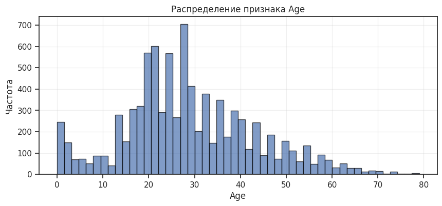
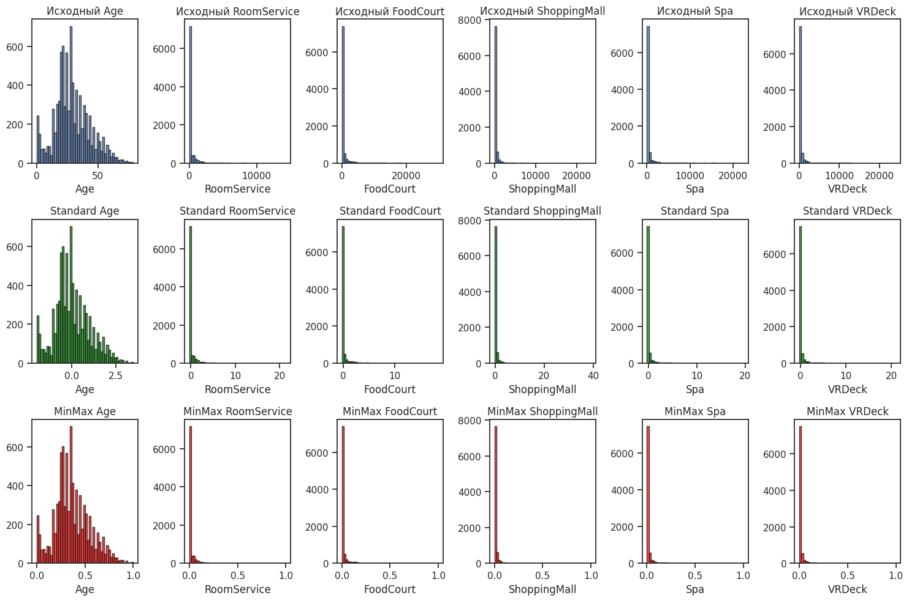

# Лабораторная работа №2
## Обработка пропусков в данных, кодирование категориальных признаков, масштабирование данных

### Цель работы:
Изучить методы обработки пропущенных значений, кодирования категориальных признаков и масштабирования данных на примере датасета Spaceship Titanic.

---

## 1. Загрузка данных и первичный анализ

### Импорт библиотек

```python
import numpy as np
import pandas as pd
import seaborn as sns
import matplotlib.pyplot as plt
%matplotlib inline 
sns.set(style="ticks")
```

### Загрузка датасета

```python
sample_data = pd.read_csv('train.csv')
print("Размер данных:", sample_data.shape)
print("\nПервые 5 строк:")
print(sample_data.head())
```

**Результат выполнения:**
```
Размер данных: (8693, 14)

Первые 5 строк:
  PassengerId HomePlanet CryoSleep  Cabin  Destination   Age    VIP  \
0     0001_01     Europa     False  B/0/P  TRAPPIST-1e  39.0  False   
1     0002_01      Earth     False  F/0/S  TRAPPIST-1e  24.0  False   
2     0003_01     Europa     False  A/0/S  TRAPPIST-1e  58.0   True   
3     0003_02     Europa     False  A/0/S  TRAPPIST-1e  33.0  False   
4     0004_01      Earth     False  F/1/S  TRAPPIST-1e  16.0  False   

   RoomService  FoodCourt  ShoppingMall     Spa  VRDeck               Name  \
0          0.0        0.0           0.0     0.0     0.0    Maham Ofracculy   
1        109.0        9.0          25.0   549.0    44.0       Juanna Vines   
2         43.0     3576.0           0.0  6715.0    49.0      Altark Susent   
3          0.0     1283.0         371.0  3329.0   193.0       Solam Susent   
4        303.0       70.0         151.0   565.0     2.0  Willy Santantines   

   Transported  
0        False  
1         True  
2        False  
3        False  
4         True  
```

### Просмотр типов данных

```python
print(sample_data.dtypes)
```

**Результат выполнения:**
```
PassengerId      object
HomePlanet       object
CryoSleep        object
Cabin            object
Destination      object
Age             float64
VIP              object
RoomService     float64
FoodCourt       float64
ShoppingMall    float64
Spa             float64
VRDeck          float64
Name             object
Transported        bool
dtype: object
```

---

## 2. Анализ пропущенных значений

### 2.1 Подсчет пропусков в каждом столбце

```python
sample_data.isnull().sum()
```

**Результат выполнения:**
```
PassengerId       0
HomePlanet      201
CryoSleep       217
Cabin           199
Destination     182
Age             179
VIP             203
RoomService     181
FoodCourt       183
ShoppingMall    208
Spa             183
VRDeck          188
Name            200
Transported       0
dtype: int64
```

### 2.2 Расчет процента пропусков

```python
missing_percent = (sample_data.isnull().sum() / len(sample_data)) * 100
print(missing_percent.sort_values(ascending=False))
```

**Результат выполнения:**
```
CryoSleep       2.496261
ShoppingMall    2.392730
VIP             2.335212
HomePlanet      2.312205
Name            2.300702
Cabin           2.289198
VRDeck          2.162660
Spa             2.105142
FoodCourt       2.105142
Destination     2.093639
RoomService     2.082135
Age             2.059128
PassengerId     0.000000
Transported     0.000000
dtype: float64
```

---

## 3. Обработка пропусков (Импьютация)

### 3.1 Заполнение пропусков

```python
# Траты - заполняем 0
expenses = ['RoomService', 'FoodCourt', 'ShoppingMall', 'Spa', 'VRDeck']
sample_data[expenses] = sample_data[expenses].fillna(0)

# Age - заполняем медианой
sample_data['Age'] = sample_data['Age'].fillna(sample_data['Age'].median())

# HomePlanet, Destination - заполняем модой
sample_data['HomePlanet'] = sample_data['HomePlanet'].fillna(sample_data['HomePlanet'].mode()[0])
sample_data['Destination'] = sample_data['Destination'].fillna(sample_data['Destination'].mode()[0])

# CryoSleep и VIP (bool) - заполняем False
sample_data['CryoSleep'] = sample_data['CryoSleep'].fillna(False)
sample_data['VIP'] = sample_data['VIP'].fillna(False)

# Cabin - заполняем Unknown
sample_data['Cabin'] = sample_data['Cabin'].fillna('Unknown')
```

### 3.2 Проверка пропусков после обработки

```python
print("Пропуски после обработки:")
print(sample_data.isnull().sum())
print(f"\nВсего пропусков: {sample_data.isnull().sum().sum()}")
```

**Результат выполнения:**
```
Пропуски после обработки:
PassengerId       0
HomePlanet        0
CryoSleep         0
Cabin             0
Destination       0
Age               0
VIP               0
RoomService       0
FoodCourt         0
ShoppingMall      0
Spa               0
VRDeck            0
Name            200
Transported       0
dtype: int64

Всего пропусков: 200
```


### 3.3 Дозаполнение пропусков в колонке Name

```python
sample_data['Name'] = sample_data['Name'].fillna('Unknown')
print(sample_data.isnull().sum())
```

**Результат выполнения:**
```
PassengerId     0
HomePlanet      0
CryoSleep       0
Cabin           0
Destination     0
Age             0
VIP             0
RoomService     0
FoodCourt       0
ShoppingMall    0
Spa             0
VRDeck          0
Name            0
Transported     0
dtype: int64
```

---

## 4. Анализ категориальных признаков

### 4.1 Выявление категориальных колонок

```python
# Все категориальные колонки
cat_cols_all = []

for col in sample_data.columns:
    dt = str(sample_data[col].dtype)
    if dt == 'object':
        cat_cols_all.append(col)
        print(f'Категориальная колонка: {col}, тип: {dt}')

print(f"\nВсего категориальных колонок: {len(cat_cols_all)}")
print(cat_cols_all)
```

**Результат выполнения:**
```
Категориальная колонка: PassengerId, тип: object
Категориальная колонка: HomePlanet, тип: object
Категориальная колонка: Cabin, тип: object
Категориальная колонка: Destination, тип: object
Категориальная колонка: Name, тип: object

Всего категориальных колонок: 5
['PassengerId', 'HomePlanet', 'Cabin', 'Destination', 'Name']
```

### 4.2 Анализ уникальных значений

```python
# значения в каждой
for col in cat_cols_all:
    print(f"\n{col}:")
    print(f"Уникальных значений: {sample_data[col].nunique()}")
    print(f"Примеры: {sample_data[col].unique()[:5]}")
```

**Результат выполнения:**
```
PassengerId:
Уникальных значений: 8693
Примеры: ['0001_01' '0002_01' '0003_01' '0003_02' '0004_01']

HomePlanet:
Уникальных значений: 3
Примеры: ['Europa' 'Earth' 'Mars']

Cabin:
Уникальных значений: 6561
Примеры: ['B/0/P' 'F/0/S' 'A/0/S' 'F/1/S' 'F/0/P']

Destination:
Уникальных значений: 3
Примеры: ['TRAPPIST-1e' 'PSO J318.5-22' '55 Cancri e']

Name:
Уникальных значений: 8474
Примеры: ['Maham Ofracculy' 'Juanna Vines' 'Altark Susent' 'Solam Susent'
 'Willy Santantines']
```

---

## 5. Кодирование категориальных признаков

### 5.1 Label Encoding для целевой переменной

```python
from sklearn.preprocessing import LabelEncoder

le = LabelEncoder()
sample_data['Transported_encoded'] = le.fit_transform(sample_data['Transported'])
# False -> 0, True -> 1
```

### 5.2 Ordinal Encoding для HomePlanet и Destination

```python
from sklearn.preprocessing import OrdinalEncoder

cat_cols = ['HomePlanet', 'Destination']
X_cat = sample_data[cat_cols]

oe = OrdinalEncoder()
X_cat_encoded = oe.fit_transform(X_cat)
```

### 5.3 Добавление закодированных признаков

```python
# Добавляем новые колонки, старые оставляем
sample_data[['HomePlanet_enc', 'Destination_enc']] = X_cat_encoded

# Проверяем
print(sample_data[['HomePlanet', 'Destination', 'HomePlanet_enc', 'Destination_enc']].head())
```

**Результат выполнения:**
```
  HomePlanet  Destination  HomePlanet_enc  Destination_enc
0     Europa  TRAPPIST-1e             1.0              2.0
1      Earth  TRAPPIST-1e             0.0              2.0
2     Europa  TRAPPIST-1e             1.0              2.0
3     Europa  TRAPPIST-1e             1.0              2.0
4      Earth  TRAPPIST-1e             0.0              2.0
```

### 5.4 One-Hot Encoding для HomePlanet

```python
from sklearn.preprocessing import OneHotEncoder

ohe = OneHotEncoder(sparse_output=False)
homeplanet_ohe = ohe.fit_transform(sample_data[['HomePlanet']])

print("Форма закодированных данных:", homeplanet_ohe.shape)
print("Названия колонок:", ohe.get_feature_names_out(['HomePlanet']))
```

**Результат выполнения:**
```
Форма закодированных данных: (8693, 3)
Названия колонок: ['HomePlanet_Earth' 'HomePlanet_Europa' 'HomePlanet_Mars']
```

### 5.5 Просмотр первых строк закодированных данных

```python
print(homeplanet_ohe[:10])
```

**Результат выполнения:**
```
[[0. 1. 0.]
 [1. 0. 0.]
 [0. 1. 0.]
 [0. 1. 0.]
 [1. 0. 0.]
 [1. 0. 0.]
 [1. 0. 0.]
 [1. 0. 0.]
 [1. 0. 0.]
 [0. 1. 0.]]
```

### 5.6 Добавление One-Hot признаков в датафрейм

```python
# Создаем DataFrame с закодированными данными
homeplanet_encoded_df = pd.DataFrame(
    homeplanet_ohe,
    columns=['HomePlanet_Earth', 'HomePlanet_Europa', 'HomePlanet_Mars'],
    index=sample_data.index
)

# Добавляем к исходным данным
sample_data = pd.concat([sample_data, homeplanet_encoded_df], axis=1)

# Проверяем
print(sample_data.head())
```

**Результат выполнения:**
```
  PassengerId HomePlanet  CryoSleep  Cabin  Destination   Age    VIP  \
0     0001_01     Europa      False  B/0/P  TRAPPIST-1e  39.0  False   
1     0002_01      Earth      False  F/0/S  TRAPPIST-1e  24.0  False   
2     0003_01     Europa      False  A/0/S  TRAPPIST-1e  58.0   True   
3     0003_02     Europa      False  A/0/S  TRAPPIST-1e  33.0  False   
4     0004_01      Earth      False  F/1/S  TRAPPIST-1e  16.0  False   

   RoomService  FoodCourt  ShoppingMall     Spa  VRDeck               Name  \
0          0.0        0.0           0.0     0.0     0.0    Maham Ofracculy   
1        109.0        9.0          25.0   549.0    44.0       Juanna Vines   
2         43.0     3576.0           0.0  6715.0    49.0      Altark Susent   
3          0.0     1283.0         371.0  3329.0   193.0       Solam Susent   
4        303.0       70.0         151.0   565.0     2.0  Willy Santantines   

   Transported  Transported_encoded  HomePlanet_enc  Destination_enc  \
0        False                    0             1.0              2.0   
1         True                    1             0.0              2.0   
2        False                    0             1.0              2.0   
3        False                    0             1.0              2.0   
4         True                    1             0.0              2.0   

   HomePlanet_Earth  HomePlanet_Europa  HomePlanet_Mars  
0               0.0                1.0              0.0  
1               1.0                0.0              0.0  
2               0.0                1.0              0.0  
3               0.0                1.0              0.0  
4               1.0                0.0              0.0  
```

---

## 6. Масштабирование данных

### 6.1 Статистика до масштабирования

```python
# Числовые признаки
num_cols = ['Age', 'RoomService', 'FoodCourt', 'ShoppingMall', 'Spa', 'VRDeck']

# Статистика ДО масштабирования
print("ДО масштабирования:")
print(sample_data[num_cols].describe())
```

**Результат выполнения:**
```
ДО масштабирования:
               Age   RoomService     FoodCourt  ShoppingMall           Spa  \
count  8693.000000   8693.000000   8693.000000   8693.000000   8693.000000   
mean     28.790291    220.009318    448.434027    169.572300    304.588865   
std      14.341404    660.519050   1595.790627    598.007164   1125.562559   
min       0.000000      0.000000      0.000000      0.000000      0.000000   
25%      20.000000      0.000000      0.000000      0.000000      0.000000   
50%      27.000000      0.000000      0.000000      0.000000      0.000000   
75%      37.000000     41.000000     61.000000     22.000000     53.000000   
max      79.000000  14327.000000  29813.000000  23492.000000  22408.000000   

             VRDeck  
count   8693.000000  
mean     298.261820  
std     1134.126417  
min        0.000000  
25%        0.000000  
50%        0.000000  
75%       40.000000  
max    24133.000000  
```

### 6.2 Сравнение методов масштабирования с визуализацией

```python
import matplotlib.pyplot as plt
import seaborn as sns
from sklearn.preprocessing import StandardScaler, MinMaxScaler

num_cols = ['Age', 'RoomService', 'FoodCourt', 'ShoppingMall', 'Spa', 'VRDeck']

# Исходные данные
plt.figure(figsize=(15, 10))
for i, col in enumerate(num_cols, 1):
    plt.subplot(3, 6, i)
    plt.hist(sample_data[col].dropna(), bins=50, edgecolor='black', alpha=0.7)
    plt.title(f'Исходный {col}')
    plt.xlabel(col)

# StandardScaler
scaler = StandardScaler()
scaled_data = scaler.fit_transform(sample_data[num_cols])

for i, col in enumerate(num_cols, 7):
    plt.subplot(3, 6, i)
    plt.hist(scaled_data[:, i-7], bins=50, edgecolor='black', alpha=0.7, color='green')
    plt.title(f'Standard {col}')
    plt.xlabel(col)

# MinMaxScaler
minmax_scaler = MinMaxScaler()
minmax_data = minmax_scaler.fit_transform(sample_data[num_cols])

for i, col in enumerate(num_cols, 13):
    plt.subplot(3, 6, i)
    plt.hist(minmax_data[:, i-13], bins=50, edgecolor='black', alpha=0.7, color='red')
    plt.title(f'MinMax {col}')
    plt.xlabel(col)

plt.tight_layout()
plt.show()
```



---

## Выводы по работе

### 1. Обработка пропусков в данных

- В исходном датасете обнаружены пропуски в 12 из 14 колонок (около 2-2.5% в каждой)
- Для числовых признаков (траты) пропуски заполнены нулями
- Возраст заполнен медианой для устойчивости к выбросам
- Категориальные признаки заполнены модой или значением 'Unknown'
- Булевы признаки заполнены False
- После обработки все пропуски устранены

### 2. Кодирование категориальных признаков

- Выявлено 5 категориальных колонок: PassengerId, HomePlanet, Cabin, Destination, Name
- Для целевой переменной Transported применен Label Encoding
- Для HomePlanet и Destination применены:
  * Ordinal Encoding (присвоение числовых меток)
  * One-Hot Encoding (создание бинарных признаков)

### 3. Масштабирование данных

- Проведено сравнение двух методов масштабирования:
  * StandardScaler - центрирует данные относительно среднего (0) с единичным стандартным отклонением
  * MinMaxScaler - масштабирует данные в диапазон [0, 1]
- Гистограммы наглядно показывают трансформацию распределений

```
